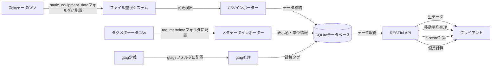

# DataStream Hub

DataStream Hubは、製造設備の時系列データを安全に管理・提供するためのデータハブサーバーです。工場設備やセンサーから継続的に生成されるデータストリームを取り込み、統一されたRESTful APIを通じてクライアントアプリケーションに提供します。既存の産業用データシステムを補完し、データ活用の可能性を広げる柔軟な中間層として機能します。

[](https://opensource.org/licenses/MIT)

## 存在価値と使命

DataStream Hubは以下の課題を解決するために開発されました：

- **既存データの価値向上** - 産業設備から収集される膨大なデータを、活用しやすい形に変換し付加価値を創出
- **データアクセスの標準化** - 多様なデータソースへの統一的なアクセス方法を提供し、アプリケーション開発を効率化
- **セキュアな中間層の実現** - 重要な生産システムとクライアントアプリケーションの間に安全な中間層を構築
- **拡張性の確保** - ビジネスニーズに応じた独自の分析・処理機能を柔軟に追加できる基盤の提供
- **ベンダー固有技術からの独立** - 特定のベンダー技術に依存せず、自由なシステム設計・拡張が可能

## 主な機能

- **時系列データの統合管理** - 工場設備の様々なセンサーから収集された時系列データを一元管理
- **インテリジェントなデータ取り込み** - static_equipment_dataフォルダに配置したCSVデータファイルを自動検出してDBに格納
- **データ加工・変換** - APIを通して様々なデータ加工（移動平均、Z-score、偏差計算など）を施したデータを提供
- **統一API** - RESTful APIによるシンプルで一貫性のあるデータアクセス
- **多言語対応** - タグIDに対する多言語表示名マッピング機能
- **拡張可能なアーキテクチャ** - 外部プロセッサによる処理機能の柔軟な拡張
- **仮想タグ（gtag）機能** - 実データの組み合わせや演算による新たな指標値の生成
- **Docker対応** - コンテナ環境での簡単なデプロイと運用

## 適用シナリオ

### データの民主化と活用促進

既存の産業用データウェアハウスシステムは強力ですが、しばしば専門知識を持つ一部のユーザーだけがアクセス可能です。DataStream Hubはこれらのシステムから抽出したデータをより使いやすい形で提供し、社内のより多くの部門・担当者がデータを活用できる環境を構築します。

### 既存システムの安全な拡張

本番稼働中の産業用データシステムに直接アクセスすることなく、安全なデータアクセス・加工を実現します。これにより、クリティカルなシステムに影響を与えることなく、新しい分析ツールや可視化ダッシュボードを開発できます。

### エッジデバイスとの統合

工場現場に設置されたエッジデバイスからのデータを収集・統合し、中央データシステムと連携します。これにより、リアルタイム処理と長期的なデータ分析を組み合わせた高度なアプリケーション構築が可能になります。

### 予測メンテナンスプラットフォーム

センサーデータを統計的に処理し異常検知を行ったり、Pythonベースの機械学習モデルを統合して将来の故障予測を行うなど、DataStream Hubが提供する機能を活用して予測メンテナンスシステムの基盤として利用できます。

### カスタムアプリケーション開発の基盤

モバイルアプリやWebダッシュボードなど、設備データを活用したカスタムアプリケーション開発のためのバックエンド基盤として機能します。統一されたAPIを通じて、フロントエンド開発を大幅に効率化します。

## データフロー

以下は、DataStream Hubにおけるデータの流れを示しています：



DataStream Hubは現在、`static_equipment_data`フォルダに設置された静的CSVファイルからのデータ取り込みをサポートしています。将来的には、各種産業用データシステムのAPIを利用した動的なデータ取得機能も追加される予定です。これにより、静的データと動的データを組み合わせた柔軟なデータ管理が可能になります。

## クイックスタート

### 前提条件

- Node.js 18以上
- npm または yarn
- （オプション）Docker & Docker Compose
- Python 3.x（外部プロセッサ使用時）

### インストール

```bash
# リポジトリのクローン
git clone https://github.com/toorpia/datastream-hub.git
cd datastream-hub

# 依存関係のインストール
npm install

# Python依存関係のインストール（外部プロセッサ使用する場合）
pip install -r processors/requirements.txt
```

### 使用方法

```bash
# 開発サーバーの起動
npm start

# Docker環境での起動
cd docker
docker-compose up -d
```

#### 設備データの取り込みと活用方法

1. 設備データをCSV形式で準備します（サポートされている形式：タイムスタンプ列 + 複数のタグ値列）
2. CSVファイルを `static_equipment_data` フォルダに配置します
3. システムが自動的にファイルを検出し、データベースに取り込みます（サーバー起動時と1分おきに確認）
4. 取り込まれたデータはAPIを通して以下の形式で取得可能になります：
   - 生データの取得（元のデータをそのまま取得）
   - 移動平均処理（ノイズを除去したデータ取得）
   - Z-scoreの計算（異常検知のための標準化スコア）
   - 偏差計算（平均からの乖離）
   - カスタム処理（外部プロセッサによる拡張機能）

#### サポートされているCSVフォーマット

- タイムスタンプ列は「time」「date」などの名前を含むことが推奨されます
- タイムスタンプ形式：`YYYY-MM-DD HH:mm:ss`、`YYYY/MM/DD HH:mm:ss`など
- タグ名は設備IDとファイル名から自動的に生成されます（例：ファイル名が`Pump01.csv`で列名が`Flow`の場合、タグIDは`Pump01.Flow`となります）

詳細な使用方法については、[運用マニュアル](docs/ja/operations_manual.md)を参照してください。

## 技術アーキテクチャ

DataStream Hubは以下の技術コンポーネントで構成されています：

- **バックエンド**: Node.js + Express.js
- **データストレージ**: SQLite（デフォルト）、他DBへの拡張可能
- **データインポート**: CSVパーサー + ファイル監視
- **APIレイヤー**: RESTful API（JSON形式）
- **拡張エンジン**: 外部プロセッサ（Python/その他言語）

これらのコンポーネントは疎結合な設計となっており、必要に応じて個別に拡張・置換することができます。たとえば、SQLiteをTimescaleDBに置き換えたり、新しい種類の外部プロセッサを追加することが可能です。

## ドキュメント

- [運用マニュアル](docs/ja/operations_manual.md) - インストール、設定、運用の詳細
- [APIマニュアル](docs/ja/api_manual.md) - APIエンドポイントの詳細と使用例
- [開発者ガイド](docs/ja/developer_guide.md) - アーキテクチャ、コード詳細、拡張方法

## データベースの選択と拡張性

DataStream Hubは現在SQLiteをデータストレージとして使用しています。これは小〜中規模の導入に適していますが、より大規模なデプロイメントでは、以下のエンタープライズグレードのデータベースへの移行も検討できます：

1. **TimescaleDB** - PostgreSQLの拡張として、高度な時系列機能を提供
   - **長所**: PostgreSQLの拡張であるため、SQLの知識がそのまま活用できる。標準SQLのみならず時系列特有の機能も充実。
   - **適用例**: 既存のSQLスキルを活用しつつ、時系列データの拡張性を求めるケース

2. **InfluxDB** - 時系列データに特化した高性能データベース
   - **長所**: IoTや監視向けに特化した時系列データベース。高い書き込みパフォーマンスと効率的なストレージ。
   - **適用例**: 大量のセンサーデータを高速に取り込む必要があるケース

3. **QuestDB** - SQLインターフェースを持つ高速な時系列データベース
   - **長所**: 極めて高速なクエリ実行と低いリソース消費。SQLサポートにより学習曲線が緩やか。
   - **適用例**: リアルタイム分析や高速クエリが重要なケース

今後のリリースで、これらのデータベースへのプラグイン方式でのサポートを追加する予定です。

## 将来の展望

DataStream Hubは継続的に進化するプロジェクトであり、以下の機能拡張を計画しています：

- **リアルタイムデータ連携** - 産業用データシステムとのリアルタイム連携機能
- **より高度な分析エンジン** - 機械学習モデルとの統合強化
- **アラート・通知システム** - 異常検知や閾値超過時の通知機能
- **ビジュアル分析ツール** - データ可視化のための組み込みダッシュボード
- **クラスタリング対応** - 大規模導入向けの水平スケーリング機能

これらの機能は、コミュニティのフィードバックを取り入れながら優先順位を決定し、段階的に実装していく予定です。

## ライセンス

このプロジェクトはMITライセンスの下で公開されています。詳細は[LICENSE](LICENSE)ファイルを参照してください。商用利用を含め、自由に活用いただけます。

## 貢献

貢献は歓迎します！バグレポート、機能提案、プルリクエストなど、あらゆる形式の貢献に感謝します。大きな変更を加える前に、まずIssueでディスカッションを開始してください。

[貢献ガイドライン](CONTRIBUTING.md)もご覧ください。
