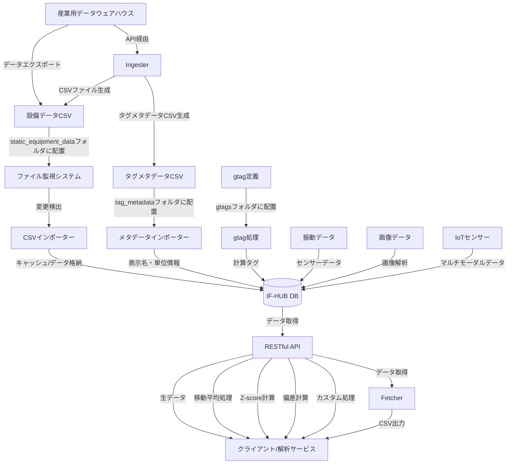

# IndustryFlow Hub (IF-HUB)

IndustryFlow Hub（IF-HUB）は、製造設備の時系列データを安全かつ柔軟に管理・提供するためのデータハブサーバーです。PI Systemをはじめとする産業用データウェアハウスの標準APIと解析サービスの間に位置するオープンソースの中間層として設計されており、各種制約により難しいサーバー側の直接的なカスタマイズを、容易かつ効率的に実現します。

## 📋 システム構成要素

IF-HUBは以下の主要コンポーネントで構成されています：

### コアシステム
- **IF-Hub Core** (`src/`) - メインアプリケーション（Node.js/Express）
- **RESTful API** - 統一されたデータアクセスインターフェース

### データ処理コンポーネント
- **Fetcher** (`fetcher/`) - **データ抽出・条件フィルタリング機構**
  - 設備単位・条件付きでのタグ/gtagデータ抽出
  - CSVフォーマットでの出力機能
  - 柔軟な条件指定とフィルタリング
  
- **Ingester** (`ingester/`) - **PI Systemデータ取り込み機構**
  - 上流データウェアハウス（PI System等）からの自動データ取り込み
  - スケジュール実行による継続的データ同期
  - バッチ処理によるデータ品質保証

### 拡張機能
- **gTag システム** (`gtags/`) - 仮想タグ生成・計算処理
- **プラグインシステム** (`plugins/`) - analyzer、notifier、presenter型プラグインによる拡張機能
- **オフライン配布** (`offline-deployment/`) - 顧客環境移行ツール


## 存在価値と使命

IF-HUBは以下の課題を解決します：

- **産業用データウェアハウスの制約を解消する中間層**：セキュリティや保守性の理由から、直接的なカスタマイズが困難な産業用データウェアハウスのAPIに対し、中間層として柔軟な拡張性を提供
- **時系列データの高度な加工と変換の実現**：移動平均、サンプリング、各種アルゴリズムを用いた補完処理、統計変換（Zスコア、偏差計算）などを自由に適用可能
- **統一されたデータアクセス手段の提供**：多様なバックエンドシステムからのデータ取得を標準化し、クライアント開発を効率化

## 主な機能

- **時系列データの一元管理**：複数のデータソースからの時系列データを統合して管理
- **統一されたRESTful API**：一貫性のあるデータアクセスとオープンソース化による自由なカスタマイズ
- **仮想タグ（gtag）生成**：複数データの演算や組み合わせによる新たな仮想的指標を作成（Python、Rust、Go、C/C++対応）
- **柔軟なデータ処理**：移動平均、Z-score、偏差値などの統計処理をAPI経由で直接適用
- **多言語対応**：タグ名や属性の多言語表示名マッピング機能
- **データフェッチング機能（Fetcher）**：設備単位・条件付きでのタグ/gtagデータ抽出機構
- **上流DB連携機能（Ingester）**：上流のデータウェアハウス(PI System etc.)からの自動データ取り込み
- **Docker対応**：コンテナ環境による容易なデプロイとスケーラブルな運用

詳細な機能説明については、[APIマニュアル](docs/ja/api_manual.md)と[運用マニュアル](docs/ja/operations_manual.md)をご参照ください。


## 適用シナリオ

### データの民主化と活用促進

既存の産業用データウェアハウスシステムは強力ですが、しばしば専門知識を持つ一部のユーザーだけがアクセス可能です。IF-HUBはこれらのシステムから抽出したデータをより使いやすい形で提供し、社内のより多くの部門・担当者がデータを活用できる環境を構築します。

### 既存システムの安全な拡張

本番稼働中の産業用データシステムに直接アクセスすることなく、安全なデータアクセス・加工を実現します。これにより、クリティカルなシステムに影響を与えることなく、新しい分析ツールや可視化ダッシュボードを開発できます。

### 予兆保全プラットフォーム

IndustryFlow Hubを介することにより、製造設備からの様々な時系列データにIoT等から収集されるセンサーデータや画像データなどを統合可能とし、マルチモーダルかつ高度な予測システムの実現のための基盤を提供します。

### カスタムアプリケーション開発の基盤

モバイルアプリやWebダッシュボードなど、設備データを活用したカスタムアプリケーション開発のためのバックエンド基盤として機能します。統一されたAPIを通じて、フロントエンド開発を大幅に効率化します。

## アーキテクチャの設計思想

IF-HUBは、上流の産業用データウェアハウス（PI Systemなど）との統合において、**意図的に粗結合設計**を採用しています。これには以下の重要な理由があります：

1. **上流システムの仕様変更に対する耐性** - 大規模DBとの直結合では、上流の仕様変更の影響を大きく受けてしまいます。CSVファイルを介した粗結合やbatchwiseなデータ取得により、この影響を最小限に抑えています。
2. **セキュリティバウンダリの明確化** - 直接接続ではなくファイル転送やRESTful API経由のデータ交換は、セキュリティ境界を明確にし、重要なシステムへの不正アクセスリスクを軽減します。
3. **インターフェース変更の柔軟性** - 接続方式の変更や機能拡張を、上流システムに依存せず独立して行うことができます。
4. **一時キャッシュによる安定性向上** - データをローカルデータベースにキャッシュすることで、処理の安定性、レスポンス速度の改善、外部システム障害時の継続運用が可能になります。

この設計により、IndustryFlow Hubは上流システムの制約から解放され、自由度の高いデータ加工・分析機能を提供できます。加えて、拡張プロセッサを通じて多様なプログラミング言語（Python、Rust、Go、C/C++など）による高度なデータ処理も柔軟に組み込むことができます。

## パフォーマンスと拡張性への取り組み

IF-HUBでは、以下の点においてパフォーマンスと拡張性を継続的に向上させています：

- **効率的なデータ処理**：
  - 処理関数の最適化によるパフォーマンス向上
  - 大規模データセットでも効率的に動作

- **モジュール化されたデータ処理**：
  - 役割ごとに明確に分けられたモジュール構造
  - 新しいアルゴリズム追加が容易な設計

- **一貫したAPI設計**：
  - すべてのエンドポイントで一貫した処理オプションを提供
  - 汎用パラメータによる柔軟なデータ取得と処理

## データフロー

以下は、IF-HUBにおけるデータの流れを示しています：



IndustryFlow Hubは現在、主に`static_equipment_data`フォルダに設置された静的CSVファイルからのデータ取り込みをサポートしています。これは産業用データウェアハウスからエクスポートされたデータを想定しており、意図的な粗結合設計となっています。加えて、特定のユースケースに応じて産業用データシステムのAPIを利用したbatchwiseなデータ取得機能も実装を計画しており、一時キャッシュによる安定性とレスポンス速度の改善を実現していきます。将来的には、これらの機能をさらに拡張しつつも、柔軟性とシステム間の独立性を保つ設計思想を維持します。

## 📌 データベースバージョンについて

IF-HUBは2025年12月より、データベースバックエンドを**SQLite3からTimescaleDB（PostgreSQL拡張）へ移行**しました。

### 現行版（TimescaleDB）
mainブランチはTimescaleDBを使用しており、大規模な時系列データ管理に最適化されています。

### 旧版（SQLite3）
従来のSQLite3版が必要な場合は、以下のタグから利用可能です：

```bash
# SQLite3版をチェックアウト
git checkout sqlite3-legacy
```

> **注意:** SQLite3版は開発を終了しており、今後の機能追加やバグ修正は行われません。新規利用の場合はTimescaleDB版をご利用ください。

## 🔧 開発環境でのクイックスタート

### 前提条件

**Docker環境（推奨）：**
- Docker & Docker Compose

**ネイティブ環境：**
- Node.js 18以上
- npm または yarn
- PostgreSQL 14以上 + TimescaleDB extension

### インストールと起動

#### Docker環境での起動（推奨）

Docker環境では、TimescaleDB/PostgreSQLのインストールは不要です。すべてコンテナとして動作します。

```bash
# リポジトリのクローン
git clone https://github.com/toorpia/if-hub.git
cd if-hub

# 環境変数の設定（オプション）
cp env.timescaledb.example env.timescaledb
# 必要に応じて env.timescaledb ファイルを編集

# Docker Composeで起動（TimescaleDB + IF-Hub）
cd docker
docker compose -f docker-compose.timescaledb.yml up -d

# ログの確認
docker compose -f docker-compose.timescaledb.yml logs -f
```

> **⚠️ 本番環境デプロイ前の重要な確認事項**
>
> 上流データソースの**サンプリングレート**によって、TimescaleDBの設定を調整する必要があります。
> 詳細は下記の「[本番環境へのデプロイ時の考慮事項](#本番環境へのデプロイ時の考慮事項)」を必ずご確認ください。

#### ネイティブ環境での起動

ネイティブ環境では、PostgreSQL + TimescaleDBを事前にインストールする必要があります。

```bash
# リポジトリのクローン
git clone https://github.com/toorpia/if-hub.git
cd if-hub

# 依存関係のインストール
npm install

# TimescaleDBの準備（事前にPostgreSQLとTimescaleDBがインストール済みであること）
# データベースとユーザーを作成
psql -U postgres -c "CREATE DATABASE if_hub;"
psql -U postgres -c "CREATE USER if_hub_user WITH PASSWORD 'your_password';"
psql -U postgres -c "GRANT ALL PRIVILEGES ON DATABASE if_hub TO if_hub_user;"

# スキーマ初期化
psql -U if_hub_user -d if_hub -f docker/init-timescaledb.sql

# 環境変数の設定
export TIMESCALE_HOST=localhost
export TIMESCALE_PORT=5432
export TIMESCALE_DB=if_hub
export TIMESCALE_USER=if_hub_user
export TIMESCALE_PASSWORD=your_password

# アプリケーションの起動
npm start
```

### 基本的な動作確認

1. **サーバーの起動確認**
   ```bash
   # ブラウザで以下にアクセス
   http://localhost:3001/api/status
   ```

2. **テストデータの生成**（必要に応じて）
   ```bash
   npm run generate-data
   ```

3. **設備データの配置**
   - CSVファイルを `static_equipment_data/` フォルダに配置
   - システムが自動的に検出・取り込み（1分以内）

### 開発者向け詳細情報
- **詳細なAPIドキュメント**: [APIマニュアル](docs/ja/api_manual.md)
- **アーキテクチャと拡張方法**: [開発者ガイド](docs/ja/developer_guide.md)
- **運用とメンテナンス**: [運用マニュアル](docs/ja/operations_manual.md)

## 📦 顧客環境・オフライン環境への配布

### 概要
顧客環境やネットワーク接続のない環境への配布には、専用の配布パッケージシステムを使用します。

### 配布の特徴
- **自動パッケージ生成**: 最適化された配布パッケージを自動作成
- **ネットワーク不要**: インターネット接続なしで完全動作
- **簡単セットアップ**: 3ステップでの自動セットアップ
- **PI System統合**: 自動データ取り込み機能付き

### 基本フロー

```bash
# 開発環境: パッケージ作成
./offline-deployment/deployment-tools/create-package.sh

# 顧客環境: 3ステップ実行
tar -xzf if-hub-*.tgz && cd if-hub
./configure-pi.sh
./setup.sh
```

### 詳細な配布手順
**完全な手順・設定・トラブルシューティング** → [OFFLINE_DEPLOYMENT_GUIDE.md](OFFLINE_DEPLOYMENT_GUIDE.md)

## 技術アーキテクチャ

IF-HUBは以下の技術コンポーネントで構成されています：

- **バックエンド**: Node.js + Express.js
- **データストレージ**: TimescaleDB (PostgreSQL extension)
  - ハイパーテーブルによる効率的な時系列データ管理
  - 自動データ圧縮（90%以上のストレージ削減）
  - 時間バケット機能による高速集計
  - 継続的集計（Continuous Aggregates）対応
- **データインポート**: CSVパーサー + ファイル監視、API経由batchwiseデータ取得
- **APIレイヤー**: RESTful API（JSON形式）、統一されたエンドポイント設計
- **拡張エンジン**: 外部プロセッサ対応
  - **Python**: 統計処理、機械学習、データサイエンス
  - **Rust/Go**: 高性能な計算処理、メモリ効率の高い処理
  - **C/C++**: レガシーコードの統合、極めて高速な処理
  - **その他**: カスタム言語プロセッサの追加も可能

これらのコンポーネントは疎結合な設計となっており、必要に応じて個別に拡張・置換することができます。TimescaleDBは産業用時系列データの管理に最適化されており、大規模なデータセットでも高いパフォーマンスを維持します。

## ファイル構成

IF-HUBは以下の主要ディレクトリで構成されています：

```
/
├── src/                     # メインアプリケーション（Node.js/Express）
├── fetcher/                 # データ抽出・条件フィルタリング機構
├── ingester/                # PI Systemデータ取り込み機構
├── gtags/                   # 仮想タグ定義と計算スクリプト
├── docker/                  # Docker関連設定ファイル
│   ├── docker-compose.timescaledb.yml  # TimescaleDB環境
│   └── init-timescaledb.sql            # DB初期化スクリプト
├── docs/                    # プロジェクトドキュメント
├── static_equipment_data/   # 設備データCSV格納ディレクトリ
├── tag_metadata/            # タグメタデータ格納ディレクトリ
└── logs/                    # ログファイル
```

### 重要なディレクトリ

- **`static_equipment_data/`**: 設備データCSVファイルを配置（自動検出・インポート）
- **`gtags/`**: 仮想タグ（計算タグ）の定義を格納
- **`tag_metadata/`**: タグの表示名や単位情報を格納
- **`docker/`**: Docker環境用設定（TimescaleDB + IF-Hub）

詳細なファイル構成については、[開発者ガイド](docs/ja/developer_guide.md)をご参照ください。

## ドキュメント

- **[本番環境デプロイガイド](docs/ja/deployment_guide.md) - サンプリングレート別の設定最適化（本番デプロイ前に必読）**
- [運用マニュアル](docs/ja/operations_manual.md) - インストール、設定、運用の詳細
- [APIマニュアル](docs/ja/api_manual.md) - APIエンドポイントの詳細と使用例
- [開発者ガイド](docs/ja/developer_guide.md) - アーキテクチャ、コード詳細、拡張方法
- [プラグインシステムガイド](docs/ja/plugin.md) - プラグイン開発・運用の詳細
- [高次元時系列データのリサンプリング原則](docs/ja/timeseries_resampling_principles.md) - 時系列データの前処理と解析における理論的基礎
- [TimescaleDB移行設計](docs/timescaledb-migration-design.md) - データベースアーキテクチャの詳細

## TimescaleDBの特徴と利点

IF-HUBが採用しているTimescaleDBは、PostgreSQLの拡張として時系列データに特化した機能を提供します：

### 主な特徴
- **ハイパーテーブル**: 時系列データを自動的に最適なチャンクに分割し、クエリパフォーマンスを向上
- **自動圧縮**: 古いデータを自動的に圧縮し、ストレージ使用量を90%以上削減
- **時間バケット機能**: `time_bucket()`関数による高速なダウンサンプリング・集計
- **継続的集計**: リアルタイムで更新されるマテリアライズドビュー
- **PostgreSQL互換**: 既存のPostgreSQLツールやエコシステムをそのまま活用可能

### 適用例
- **大量の時系列データ**: 数百万〜数億レコードの効率的な管理
- **高速なクエリ**: 時間範囲指定による高速なデータ取得
- **長期データ保存**: 自動圧縮による効率的なストレージ利用
- **リアルタイム分析**: 継続的集計による即座のデータ可視化

詳細なパフォーマンス特性とチューニングについては、[TimescaleDB移行設計書](docs/timescaledb-migration-design.md)をご参照ください。

## 将来の展望

IF-HUBは継続的に進化するプロジェクトであり、以下の機能拡張を計画しています：

- **API連携の拡充** - より多様な産業用データシステムとのAPIベース連携機能（OPC UA、MQTT、PI Web API等）
- **キャッシュ最適化** - TimescaleDBの継続的集計を活用した更なるパフォーマンス向上
- **リアルタイム処理** - streambased処理オプションの追加によるリアルタイムデータ変換
- **インタラクティブな可視化** - 簡易なデータ探索・分析ダッシュボード
- **高度な時系列機能** - TimescaleDBの機能を活用した補間、ギャップ埋め、時間加重平均などの実装

これらの機能は、ユーザーニーズとコミュニティフィードバックに基づいて優先順位を決定し、段階的に実装していく予定です。

## ライセンスについて

このプロジェクトは Business-Friendly License (BFL) のもとで提供されています。

**ライセンス形態：Business-Friendly License (BFL)**
- **商用利用**：商用環境での利用には、別途ライセンス契約が必要です
- **検証・開発用途**：実証実験・PoCなど社内検証用途にはご自由にお使いいただけます
- **ソースコード公開**：透明性とコミュニティ貢献のため、ソースコードはGitHub上でオープンに公開しています
- **永続ライセンス**：このプロジェクトは継続してBFLライセンスのもとで提供されます

詳細については、[LICENSE](./LICENSE) ファイルをご参照ください。

## 貢献

貢献は歓迎します！バグレポート、機能提案、プルリクエストなど、あらゆる形式の貢献に感謝します。大きな変更を加える前に、まずIssueでディスカッションを開始してください。

[貢献ガイドライン](CONTRIBUTING.md)もご覧ください。
