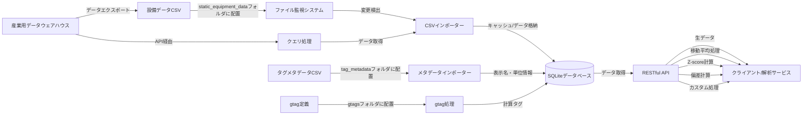

# DataStream Hub

DataStream Hubは、製造設備の時系列データを安全かつ柔軟に管理・提供するためのデータハブサーバーです。PI Systemをはじめとする産業用データウェアハウスの標準APIと解析サービスの間に位置するオープンソースの中間層として設計されており、各種制約により難しいサーバー側の直接的なカスタマイズを、容易かつ効率的に実現します。

具体的には、PI Web APIなどの標準的なRESTful APIから一次データストリームをbatchwiseに取得し、一時的にデータベースにキャッシュした上で、移動平均、サンプリング処理、データ補完、Zスコア化、偏差値化といった柔軟な時系列データ処理を施し、統一されたRESTful APIを通じてクライアントアプリケーションに提供します。一時データベースを保有することで、処理の安定性向上、レスポンス速度の改善、外部データソースの障害時にも一定期間データを提供し続けることが可能になります。

また、Python、Rust、Go、C/C++など、各種言語で作成された外部プログラムを取り込むことが可能で、高度なデータ処理を柔軟に拡張できます。

[](https://opensource.org/licenses/MIT)

## 存在価値と使命

DataStream Hubは以下の課題を解決します：

- **産業用データウェアハウスの制約を解消する中間層**：セキュリティや保守性の理由から、直接的なカスタマイズが困難な産業用データウェアハウスのAPIに対し、中間層として柔軟な拡張性を提供
- **時系列データの高度な加工と変換の実現**：移動平均、サンプリング、各種アルゴリズムを用いた補完処理、統計変換（Zスコア、偏差計算）などを自由に適用可能
- **統一されたデータアクセス手段の提供**：多様なバックエンドシステムからのデータ取得を標準化し、クライアント開発を効率化

## 主な機能

- **時系列データの一元管理**：複数のデータソースからの時系列データを統合して管理
- **インテリジェントなデータ取り込み**：指定フォルダ内のCSVファイルを自動的に検出・処理してDBに格納
- **柔軟なデータ加工・変換機能**：RESTful API経由で、移動平均化や標準化（Z-score化）などのデータ加工処理を施した結果を提供
- **シンプルで統一されたAPIインターフェース**：RESTful設計による一貫性のあるデータアクセスを提供し、オープンソース化による自由なAPIカスタマイズも可能
- **多言語対応**：タグ名や属性の多言語表示名マッピング機能
- **柔軟に拡張可能なアーキテクチャ**：外部のプロセス（Python、Rust、Go、C/C++等）を統合可能なモジュール設計により、容易な機能追加や拡張を実現
- **仮想タグ（gtag）生成機能**：複数データの演算や組み合わせによる新たな仮想的指標を作成可能
- **Docker対応**：コンテナ環境を活用した容易なデプロイとスケーラブルな運用を実現


## 適用シナリオ

### データの民主化と活用促進

既存の産業用データウェアハウスシステムは強力ですが、しばしば専門知識を持つ一部のユーザーだけがアクセス可能です。DataStream Hubはこれらのシステムから抽出したデータをより使いやすい形で提供し、社内のより多くの部門・担当者がデータを活用できる環境を構築します。

### 既存システムの安全な拡張

本番稼働中の産業用データシステムに直接アクセスすることなく、安全なデータアクセス・加工を実現します。これにより、クリティカルなシステムに影響を与えることなく、新しい分析ツールや可視化ダッシュボードを開発できます。

### エッジデバイスとの統合

工場現場に設置されたエッジデバイスからのデータを収集・統合し、中央データシステムと連携します。これにより、リアルタイム処理と長期的なデータ分析を組み合わせた高度なアプリケーション構築が可能になります。

### 予兆保全プラットフォーム

DataStream Hubを介することにより、製造設備からの様々な時系列データにIoT等から収集されるセンサーデータや画像データなどを統合可能とし、マルチモーダルかつ高度な予測システムの実現のための基盤を提供します。

### カスタムアプリケーション開発の基盤

モバイルアプリやWebダッシュボードなど、設備データを活用したカスタムアプリケーション開発のためのバックエンド基盤として機能します。統一されたAPIを通じて、フロントエンド開発を大幅に効率化します。

## アーキテクチャの設計思想

DataStream Hubは、上流の産業用データウェアハウス（PI Systemなど）との統合において、**意図的に粗結合設計**を採用しています。これには以下の重要な理由があります：

1. **上流システムの仕様変更に対する耐性** - 大規模DBとの直結合では、上流の仕様変更の影響を大きく受けてしまいます。CSVファイルを介した粗結合やbatchwiseなデータ取得により、この影響を最小限に抑えています。
2. **セキュリティバウンダリの明確化** - 直接接続ではなくファイル転送やRESTful API経由のデータ交換は、セキュリティ境界を明確にし、重要なシステムへの不正アクセスリスクを軽減します。
3. **インターフェース変更の柔軟性** - 接続方式の変更や機能拡張を、上流システムに依存せず独立して行うことができます。
4. **一時キャッシュによる安定性向上** - データをローカルデータベースにキャッシュすることで、処理の安定性、レスポンス速度の改善、外部システム障害時の継続運用が可能になります。

この設計により、DataStream Hubは上流システムの制約から解放され、自由度の高いデータ加工・分析機能を提供できます。加えて、拡張プロセッサを通じて多様なプログラミング言語（Python、Rust、Go、C/C++など）による高度なデータ処理も柔軟に組み込むことができます。

## データフロー

以下は、DataStream Hubにおけるデータの流れを示しています：



DataStream Hubは現在、主に`static_equipment_data`フォルダに設置された静的CSVファイルからのデータ取り込みをサポートしています。これは産業用データウェアハウスからエクスポートされたデータを想定しており、意図的な粗結合設計となっています。加えて、特定のユースケースに応じて産業用データシステムのAPIを利用したbatchwiseなデータ取得機能も実装を計画しており、一時キャッシュによる安定性とレスポンス速度の改善を実現していきます。将来的には、これらの機能をさらに拡張しつつも、柔軟性とシステム間の独立性を保つ設計思想を維持します。

## クイックスタート

### 前提条件

- Node.js 18以上
- npm または yarn
- （オプション）Docker & Docker Compose
- Python 3.x（外部プロセッサ使用時）

### インストール

```bash
# リポジトリのクローン
git clone https://github.com/toorpia/datastream-hub.git
cd datastream-hub

# 依存関係のインストール
npm install

# Python依存関係のインストール（外部プロセッサ使用する場合）
pip install -r processors/requirements.txt
```

### 使用方法

```bash
# 開発サーバーの起動
npm start

# Docker環境での起動
cd docker
docker-compose up -d
```

#### 設備データの取り込みと活用方法

1. 設備データをCSV形式で準備します（サポートされている形式：タイムスタンプ列 + 複数のタグ値列）
2. CSVファイルを `static_equipment_data` フォルダに配置します
3. システムが自動的にファイルを検出し、データベースに取り込みます（サーバー起動時と1分おきに確認）
4. 取り込まれたデータはAPIを通して以下の形式で取得可能になります：
   - 生データの取得（元のデータをそのまま取得）
   - 移動平均処理（ノイズを除去したデータ取得）
   - Z-scoreの計算（異常検知のための標準化スコア）
   - 偏差計算（平均からの乖離）
   - カスタム処理（外部プロセッサによる拡張機能）

#### サポートされているCSVフォーマット

- タイムスタンプ列は「time」「date」などの名前を含むことが推奨されます
- タイムスタンプ形式：`YYYY-MM-DD HH:mm:ss`、`YYYY/MM/DD HH:mm:ss`など
- タグ名は設備IDとファイル名から自動的に生成されます（例：ファイル名が`Pump01.csv`で列名が`Flow`の場合、タグIDは`Pump01.Flow`となります）

詳細な使用方法については、[運用マニュアル](docs/ja/operations_manual.md)を参照してください。

## 技術アーキテクチャ

DataStream Hubは以下の技術コンポーネントで構成されています：

- **バックエンド**: Node.js + Express.js
- **データストレージ**: SQLite（デフォルト）、一時キャッシュとして機能、他DBへの拡張可能
- **データインポート**: CSVパーサー + ファイル監視、API経由batchwiseデータ取得
- **APIレイヤー**: RESTful API（JSON形式）、統一されたエンドポイント設計
- **拡張エンジン**: 外部プロセッサ対応
  - **Python**: 統計処理、機械学習、データサイエンス
  - **Rust/Go**: 高性能な計算処理、メモリ効率の高い処理
  - **C/C++**: レガシーコードの統合、極めて高速な処理
  - **その他**: カスタム言語プロセッサの追加も可能

これらのコンポーネントは疎結合な設計となっており、必要に応じて個別に拡張・置換することができます。たとえば、SQLiteをTimescaleDBに置き換えたり、新しい種類の外部プロセッサを追加したり、データの取得方法をカスタマイズすることが可能です。

## ドキュメント

- [運用マニュアル](docs/ja/operations_manual.md) - インストール、設定、運用の詳細
- [APIマニュアル](docs/ja/api_manual.md) - APIエンドポイントの詳細と使用例
- [開発者ガイド](docs/ja/developer_guide.md) - アーキテクチャ、コード詳細、拡張方法

## データベースの選択と拡張性

DataStream Hubは現在SQLiteをデータストレージとして使用しています。これは小〜中規模の導入に適していますが、より大規模なデプロイメントでは、以下のエンタープライズグレードのデータベースへの移行も検討できます：

1. **TimescaleDB** - PostgreSQLの拡張として、高度な時系列機能を提供
   - **長所**: PostgreSQLの拡張であるため、SQLの知識がそのまま活用できる。標準SQLのみならず時系列特有の機能も充実。
   - **適用例**: 既存のSQLスキルを活用しつつ、時系列データの拡張性を求めるケース

2. **InfluxDB** - 時系列データに特化した高性能データベース
   - **長所**: IoTや監視向けに特化した時系列データベース。高い書き込みパフォーマンスと効率的なストレージ。
   - **適用例**: 大量のセンサーデータを高速に取り込む必要があるケース

3. **QuestDB** - SQLインターフェースを持つ高速な時系列データベース
   - **長所**: 極めて高速なクエリ実行と低いリソース消費。SQLサポートにより学習曲線が緩やか。
   - **適用例**: リアルタイム分析や高速クエリが重要なケース

今後のリリースで、これらのデータベースへのプラグイン方式でのサポートを追加する予定です。

## 将来の展望

DataStream Hubは継続的に進化するプロジェクトであり、以下の機能拡張を計画しています：

- **API連携の拡充** - より多様な産業用データシステムとのAPIベース連携機能（OPC UA、MQTT、PI Web API等）
- **キャッシュ最適化** - 一時キャッシュのパフォーマンス最適化とデータ保持ポリシーの柔軟な設定
- **リアルタイム処理** - streambased処理オプションの追加によるリアルタイムデータ変換
- **インタラクティブな可視化** - 簡易なデータ探索・分析ダッシュボード

これらの機能は、ユーザーニーズとコミュニティフィードバックに基づいて優先順位を決定し、段階的に実装していく予定です。

## ライセンス

このプロジェクトはMITライセンスの下で公開されています。詳細は[LICENSE](LICENSE)ファイルを参照してください。商用利用を含め、自由に活用いただけます。

## 貢献

貢献は歓迎します！バグレポート、機能提案、プルリクエストなど、あらゆる形式の貢献に感謝します。大きな変更を加える前に、まずIssueでディスカッションを開始してください。

[貢献ガイドライン](CONTRIBUTING.md)もご覧ください。
