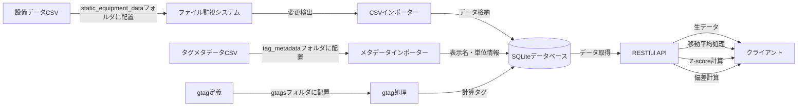

# DataStream Hub

DataStream Hubは、製造設備の時系列データを安全に管理・提供するためのデータハブサーバーです。工場設備やセンサーから継続的に生成されるデータストリームを取り込み、統一されたRESTful APIを通じてクライアントアプリケーションに提供します。

[](https://opensource.org/licenses/MIT)

## 主な機能

- **時系列データの管理**: 工場設備の様々なセンサーから収集された時系列データを一元管理
- **自動データ取り込み**: static_equipment_dataフォルダに配置したCSVデータファイルを自動検出してDBに格納し、APIを通して様々なデータ加工を施したデータを取得可能
- **統一API**: RESTful APIによるシンプルなデータアクセス
- **多言語対応**: タグIDに対する多言語表示名マッピング機能
- **データ処理**: 移動平均などの統計処理機能（外部プロセッサによる拡張可能）
- **Docker対応**: コンテナ環境での簡単なデプロイと運用

## 適用例

- 製造業における設備データの集中管理
- PIシステムなどのデータソースからの安全なデータ中継
- エッジデバイスからのデータ収集と処理
- ダッシュボードやアプリケーション向けのデータ提供

## データフロー

以下は、DataStream Hubにおけるデータの流れを示しています：



本システムは現在、`static_equipment_data`フォルダに設置された静的CSVファイルからのデータ取り込みをサポートしています。将来的には、PI-SystemなどのAPIを利用した動的なデータ取得機能も追加される予定です。これにより、静的なデータソースと動的なデータソースを組み合わせた柔軟なデータ管理が可能になります。

## クイックスタート

### 前提条件

- Node.js 18以上
- npm または yarn
- （オプション）Docker & Docker Compose
- Python 3.x（外部プロセッサ使用時）

### インストール

```bash
# リポジトリのクローン
git clone https://github.com/toorpia/datastream-hub.git
cd datastream-hub

# 依存関係のインストール
npm install

# Python依存関係のインストール（外部プロセッサを使用する場合）
pip install -r processors/requirements.txt
```

### 使用方法

```bash
# 開発サーバーの起動
npm start

# Docker環境での起動
cd docker
docker-compose up -d
```

#### 設備データの取り込みと活用方法

1. 設備データをCSV形式で準備します（サポートされている形式：タイムスタンプ列 + 複数のタグ値列）
2. CSVファイルを `static_equipment_data` フォルダに配置します
3. システムが自動的にファイルを検出し、データベースに取り込みます（サーバー起動時と1分おきに確認）
4. 取り込まれたデータはAPIを通して以下の形式で取得可能になります：
   - 生データの取得（元のデータをそのまま取得）
   - 移動平均処理（ノイズを除去したデータ取得）
   - Z-scoreの計算（異常検知のための標準化スコア）
   - 偏差計算（平均からの乖離）
   - カスタム処理（外部プロセッサによる拡張機能）

#### サポートされているCSVフォーマット

- タイムスタンプ列は「time」「date」などの名前を含むことが推奨されます
- タイムスタンプ形式：`YYYY-MM-DD HH:mm:ss`、`YYYY/MM/DD HH:mm:ss`など
- タグ名は設備IDとファイル名から自動的に生成されます（例：ファイル名が`Pump01.csv`で列名が`Flow`の場合、タグIDは`Pump01.Flow`となります）

詳細な使用方法については、[運用マニュアル](docs/ja/operations_manual.md)を参照してください。

## ドキュメント

- [運用マニュアル](docs/ja/operations_manual.md) - インストール、設定、運用の詳細
- [APIマニュアル](docs/ja/api_manual.md) - APIエンドポイントの詳細と使用例
- [開発者ガイド](docs/ja/developer_guide.md) - アーキテクチャ、コード詳細、拡張方法

## データベースの選択

DataStream Hubは現在SQLiteをデータストレージとして使用していますが、本番環境や大規模な時系列データセットには以下のデータベースがおすすめです：

1. **TimescaleDB** - PostgreSQLの拡張として、高度な時系列機能を提供
   - **長所**: PostgreSQLの拡張であるため、SQLの知識がそのまま活用できる。標準SQLのみならず時系列特有の機能も充実。
   - **適用例**: 既存のSQLスキルを活用しつつ、時系列データの拡張性を求めるケース

2. **InfluxDB** - 時系列データに特化した高性能データベース
   - **長所**: IoTや監視向けに特化した時系列データベース。高い書き込みパフォーマンスと効率的なストレージ。
   - **適用例**: 大量のセンサーデータを高速に取り込む必要があるケース

3. **QuestDB** - SQLインターフェースを持つ高速な時系列データベース
   - **長所**: 極めて高速なクエリ実行と低いリソース消費。SQLサポートにより学習曲線が緩やか。
   - **適用例**: リアルタイム分析や高速クエリが重要なケース

今後のリリースで、これらのデータベースをサポートする予定です。

## ライセンス

このプロジェクトはMITライセンスの下で公開されています。詳細は[LICENSE](LICENSE)ファイルを参照してください。

## 貢献

貢献は歓迎します！バグレポート、機能提案、プルリクエストなど、あらゆる形式の貢献に感謝します。大きな変更を加える前に、まずIssueでディスカッションを開始してください。

[貢献ガイドライン](CONTRIBUTING.md)もご覧ください。
