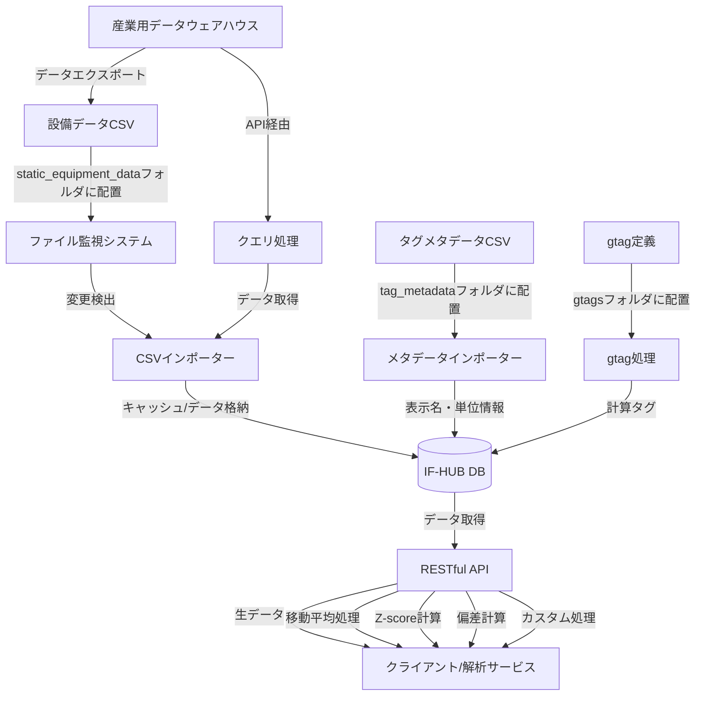

# IndustryFlow Hub (IF-HUB)

IndustryFlow Hub（IF-HUB）は、製造設備の時系列データを安全かつ柔軟に管理・提供するためのデータハブサーバーです。PI Systemをはじめとする産業用データウェアハウスの標準APIと解析サービスの間に位置するオープンソースの中間層として設計されており、各種制約により難しいサーバー側の直接的なカスタマイズを、容易かつ効率的に実現します。

## 📋 システム利用方法（2パターン）

本システムは利用目的に応じて2つの起動方法があります：

### パターン1：開発・内部テスト用
- **対象者**: 開発者、内部テスト環境
- **起動方法**: `start-if-hub.sh`スクリプト
- **特徴**: ソースコードから直接ビルド、リアルタイム変更反映
- **用途**: 機能開発、デバッグ、内部テスト

### パターン2：本番・顧客配布用  
- **対象者**: 顧客環境、本番環境、オフライン環境
- **起動方法**: `if-hub-export/`パッケージ
- **特徴**: 事前ビルド済み、インターネット接続不要
- **用途**: 商用配布、顧客環境デプロイ

---

**👈 あなたはどちらの利用者ですか？該当する方の詳細手順をご覧ください。**


## 存在価値と使命

IF-HUBは以下の課題を解決します：

- **産業用データウェアハウスの制約を解消する中間層**：セキュリティや保守性の理由から、直接的なカスタマイズが困難な産業用データウェアハウスのAPIに対し、中間層として柔軟な拡張性を提供
- **時系列データの高度な加工と変換の実現**：移動平均、サンプリング、各種アルゴリズムを用いた補完処理、統計変換（Zスコア、偏差計算）などを自由に適用可能
- **統一されたデータアクセス手段の提供**：多様なバックエンドシステムからのデータ取得を標準化し、クライアント開発を効率化

## 主な機能

- **時系列データの一元管理**：複数のデータソースからの時系列データを統合して管理
- **統一されたRESTful API**：一貫性のあるデータアクセスとオープンソース化による自由なカスタマイズ
- **仮想タグ（gtag）生成**：複数データの演算や組み合わせによる新たな仮想的指標を作成（Python、Rust、Go、C/C++対応）
- **柔軟なデータ処理**：移動平均、Z-score、偏差値などの統計処理をAPI経由で直接適用
- **多言語対応**：タグ名や属性の多言語表示名マッピング機能
- **データフェッチング機能（Fetcher）**：設備単位・条件付きでのタグ/gtagデータ抽出機構
- **上流DB連携機能（Ingester）**：上流のデータウェアハウス(PI System etc.)からの自動データ取り込み
- **Docker対応**：コンテナ環境による容易なデプロイとスケーラブルな運用

詳細な機能説明については、[APIマニュアル](docs/ja/api_manual.md)と[運用マニュアル](docs/ja/operations_manual.md)をご参照ください。


## 適用シナリオ

### データの民主化と活用促進

既存の産業用データウェアハウスシステムは強力ですが、しばしば専門知識を持つ一部のユーザーだけがアクセス可能です。IF-HUBはこれらのシステムから抽出したデータをより使いやすい形で提供し、社内のより多くの部門・担当者がデータを活用できる環境を構築します。

### 既存システムの安全な拡張

本番稼働中の産業用データシステムに直接アクセスすることなく、安全なデータアクセス・加工を実現します。これにより、クリティカルなシステムに影響を与えることなく、新しい分析ツールや可視化ダッシュボードを開発できます。

### エッジデバイスとの統合

工場現場に設置されたエッジデバイスからのデータを収集・統合し、中央データシステムと連携します。これにより、リアルタイム処理と長期的なデータ分析を組み合わせた高度なアプリケーション構築が可能になります。

### 予兆保全プラットフォーム

IndustryFlow Hubを介することにより、製造設備からの様々な時系列データにIoT等から収集されるセンサーデータや画像データなどを統合可能とし、マルチモーダルかつ高度な予測システムの実現のための基盤を提供します。

### カスタムアプリケーション開発の基盤

モバイルアプリやWebダッシュボードなど、設備データを活用したカスタムアプリケーション開発のためのバックエンド基盤として機能します。統一されたAPIを通じて、フロントエンド開発を大幅に効率化します。

## アーキテクチャの設計思想

IF-HUBは、上流の産業用データウェアハウス（PI Systemなど）との統合において、**意図的に粗結合設計**を採用しています。これには以下の重要な理由があります：

1. **上流システムの仕様変更に対する耐性** - 大規模DBとの直結合では、上流の仕様変更の影響を大きく受けてしまいます。CSVファイルを介した粗結合やbatchwiseなデータ取得により、この影響を最小限に抑えています。
2. **セキュリティバウンダリの明確化** - 直接接続ではなくファイル転送やRESTful API経由のデータ交換は、セキュリティ境界を明確にし、重要なシステムへの不正アクセスリスクを軽減します。
3. **インターフェース変更の柔軟性** - 接続方式の変更や機能拡張を、上流システムに依存せず独立して行うことができます。
4. **一時キャッシュによる安定性向上** - データをローカルデータベースにキャッシュすることで、処理の安定性、レスポンス速度の改善、外部システム障害時の継続運用が可能になります。

この設計により、IndustryFlow Hubは上流システムの制約から解放され、自由度の高いデータ加工・分析機能を提供できます。加えて、拡張プロセッサを通じて多様なプログラミング言語（Python、Rust、Go、C/C++など）による高度なデータ処理も柔軟に組み込むことができます。

## パフォーマンスと拡張性への取り組み

IF-HUBでは、以下の点においてパフォーマンスと拡張性を継続的に向上させています：

- **効率的なデータ処理**：
  - 処理関数の最適化によるパフォーマンス向上
  - 大規模データセットでも効率的に動作

- **モジュール化されたデータ処理**：
  - 役割ごとに明確に分けられたモジュール構造
  - 新しいアルゴリズム追加が容易な設計

- **一貫したAPI設計**：
  - すべてのエンドポイントで一貫した処理オプションを提供
  - 汎用パラメータによる柔軟なデータ取得と処理

## データフロー

以下は、IF-HUBにおけるデータの流れを示しています：



IndustryFlow Hubは現在、主に`static_equipment_data`フォルダに設置された静的CSVファイルからのデータ取り込みをサポートしています。これは産業用データウェアハウスからエクスポートされたデータを想定しており、意図的な粗結合設計となっています。加えて、特定のユースケースに応じて産業用データシステムのAPIを利用したbatchwiseなデータ取得機能も実装を計画しており、一時キャッシュによる安定性とレスポンス速度の改善を実現していきます。将来的には、これらの機能をさらに拡張しつつも、柔軟性とシステム間の独立性を保つ設計思想を維持します。

## 🔧 クイックスタート: パターン1：開発・内部テスト用

### 前提条件
- Node.js 18以上
- npm または yarn
- （オプション）Docker & Docker Compose

### インストールと起動

```bash
# リポジトリのクローン
git clone https://github.com/toorpia/if-hub.git
cd if-hub

# 依存関係のインストール
npm install

# 開発環境での起動（start-if-hub.shを使用）
./start-if-hub.sh

# または本番環境での起動
./start-if-hub.sh prod

# 直接起動（npm）
npm start

# Docker環境での起動
cd docker
docker-compose up -d
```

### 基本的な動作確認

1. **サーバーの起動確認**
   ```bash
   # ブラウザで以下にアクセス
   http://localhost:3001/api/status
   ```

2. **テストデータの生成**（必要に応じて）
   ```bash
   npm run generate-data
   ```

3. **設備データの配置**
   - CSVファイルを `static_equipment_data/` フォルダに配置
   - システムが自動的に検出・取り込み（1分以内）

### 開発者向け詳細情報
- **詳細なAPIドキュメント**: [APIマニュアル](docs/ja/api_manual.md)
- **アーキテクチャと拡張方法**: [開発者ガイド](docs/ja/developer_guide.md)
- **運用とメンテナンス**: [運用マニュアル](docs/ja/operations_manual.md)

## 📦 クイックスタート: パターン2：本番・顧客配布用

### 概要
顧客環境やオフライン環境での配布には、事前にビルドされた`if-hub-export/`パッケージを使用します。

### 主な特徴
- **インターネット接続不要**: 全ての必要なコンポーネントを含む
- **事前ビルド済み**: コンテナイメージとして配布
- **簡単セットアップ**: 自動設定スクリプト付き
- **PI System連携**: PI-Ingesterによる自動データ取り込み

### 基本的な配布フロー

1. **配布パッケージの作成**（開発環境）
   ```bash
   # if-hub-export.tar.gzを生成
   # 詳細手順はOFFLINE_DEPLOYMENT_GUIDE.mdを参照
   ```

2. **顧客環境での展開**
   ```bash
   # パッケージを展開
   tar -xzf if-hub-export.tar.gz
   cd if-hub-export
   
   # PI-Ingester設定（対話式）
   ./configure-pi.sh
   
   # システム起動
   ./setup.sh
   ```

3. **動作確認**
   ```bash
   # コンテナ状態確認
   docker ps | grep if-hub
   
   # ブラウザでアクセス
   http://localhost:3001
   ```

### 詳細な配布手順
**完全な配布手順とトラブルシューティング** → [OFFLINE_DEPLOYMENT_GUIDE.md](OFFLINE_DEPLOYMENT_GUIDE.md)

## 技術アーキテクチャ

IF-HUBは以下の技術コンポーネントで構成されています：

- **バックエンド**: Node.js + Express.js
- **データストレージ**: ローカルデータベース（デフォルト）、一時キャッシュとして機能、他DBへの拡張可能
- **データインポート**: CSVパーサー + ファイル監視、API経由batchwiseデータ取得
- **APIレイヤー**: RESTful API（JSON形式）、統一されたエンドポイント設計
- **拡張エンジン**: 外部プロセッサ対応
  - **Python**: 統計処理、機械学習、データサイエンス
  - **Rust/Go**: 高性能な計算処理、メモリ効率の高い処理
  - **C/C++**: レガシーコードの統合、極めて高速な処理
  - **その他**: カスタム言語プロセッサの追加も可能

これらのコンポーネントは疎結合な設計となっており、必要に応じて個別に拡張・置換することができます。たとえば、SQLiteをTimescaleDBに置き換えたり、新しい種類の外部プロセッサを追加したり、データの取得方法をカスタマイズすることが可能です。

## ファイル構成

IF-HUBは以下の主要ディレクトリで構成されています：

```
/
├── src/                     # メインアプリケーション（Node.js/Express）
├── fetcher/                 # データ抽出・条件フィルタリング機構
├── ingester/                # PI Systemデータ取り込み機構
├── gtags/                   # 仮想タグ定義と計算スクリプト
├── docker/                  # Docker関連設定ファイル
├── docs/                    # プロジェクトドキュメント
├── static_equipment_data/   # 設備データCSV格納ディレクトリ
├── tag_metadata/            # タグメタデータ格納ディレクトリ
├── db/                      # データベースファイル
└── logs/                    # ログファイル
```

### 重要なディレクトリ

- **`static_equipment_data/`**: 設備データCSVファイルを配置（自動検出・インポート）
- **`gtags/`**: 仮想タグ（計算タグ）の定義を格納
- **`tag_metadata/`**: タグの表示名や単位情報を格納
- **`docker/`**: 開発環境・本番環境用のDocker設定

詳細なファイル構成については、[開発者ガイド](docs/ja/developer_guide.md)をご参照ください。

## ドキュメント

- [運用マニュアル](docs/ja/operations_manual.md) - インストール、設定、運用の詳細
- [APIマニュアル](docs/ja/api_manual.md) - APIエンドポイントの詳細と使用例
- [開発者ガイド](docs/ja/developer_guide.md) - アーキテクチャ、コード詳細、拡張方法
- [高次元時系列データのリサンプリング原則](docs/ja/timeseries_resampling_principles.md) - 時系列データの前処理と解析における理論的基礎

## データベースの選択と拡張性

IF-HUBは現在SQLiteをデータストレージとして使用しています。これは小〜中規模の導入に適していますが、より大規模なデプロイメントでは、以下のエンタープライズグレードのデータベースへの移行も検討できます：

1. **TimescaleDB** - PostgreSQLの拡張として、高度な時系列機能を提供
   - **長所**: PostgreSQLの拡張であるため、SQLの知識がそのまま活用できる。標準SQLのみならず時系列特有の機能も充実。
   - **適用例**: 既存のSQLスキルを活用しつつ、時系列データの拡張性を求めるケース

2. **InfluxDB** - 時系列データに特化した高性能データベース
   - **長所**: IoTや監視向けに特化した時系列データベース。高い書き込みパフォーマンスと効率的なストレージ。
   - **適用例**: 大量のセンサーデータを高速に取り込む必要があるケース

3. **QuestDB** - SQLインターフェースを持つ高速な時系列データベース
   - **長所**: 極めて高速なクエリ実行と低いリソース消費。SQLサポートにより学習曲線が緩やか。
   - **適用例**: リアルタイム分析や高速クエリが重要なケース

今後のリリースで、これらのデータベースへのプラグイン方式でのサポートを追加する予定です。

## 将来の展望

IF-HUBは継続的に進化するプロジェクトであり、以下の機能拡張を計画しています：

- **API連携の拡充** - より多様な産業用データシステムとのAPIベース連携機能（OPC UA、MQTT、PI Web API等）
- **キャッシュ最適化** - 一時キャッシュのパフォーマンス最適化とデータ保持ポリシーの柔軟な設定
- **リアルタイム処理** - streambased処理オプションの追加によるリアルタイムデータ変換
- **インタラクティブな可視化** - 簡易なデータ探索・分析ダッシュボード

これらの機能は、ユーザーニーズとコミュニティフィードバックに基づいて優先順位を決定し、段階的に実装していく予定です。

## ライセンスについて

このプロジェクトは Business-Friendly License (BFL) のもとで提供されており、2028年3月20日（リリース日から3年後）に Apache License 2.0 に移行します。

現在のライセンス：Business-Friendly License (BFL)
商用利用：商用環境での利用には、別途ライセンス契約が必要です。(実証実験・PoCなど社内検証用途にはご自由にお使いいただけます。)
ライセンス移行：2028年3月20日以降、このプロジェクトは Apache License 2.0 のもとで自由に利用可能になります。
詳細については、[LICENSE](./LICENSE) ファイルをご参照ください。

## 貢献

貢献は歓迎します！バグレポート、機能提案、プルリクエストなど、あらゆる形式の貢献に感謝します。大きな変更を加える前に、まずIssueでディスカッションを開始してください。

[貢献ガイドライン](CONTRIBUTING.md)もご覧ください。
