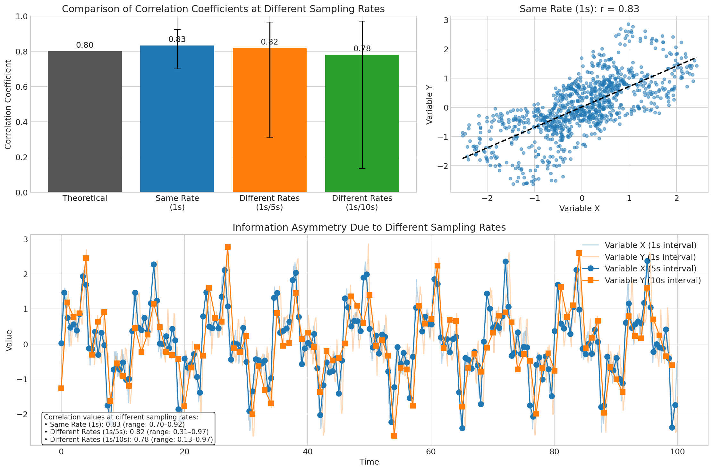
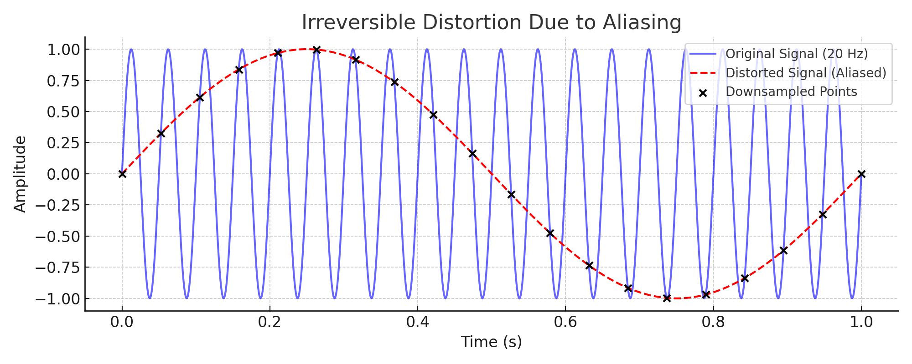
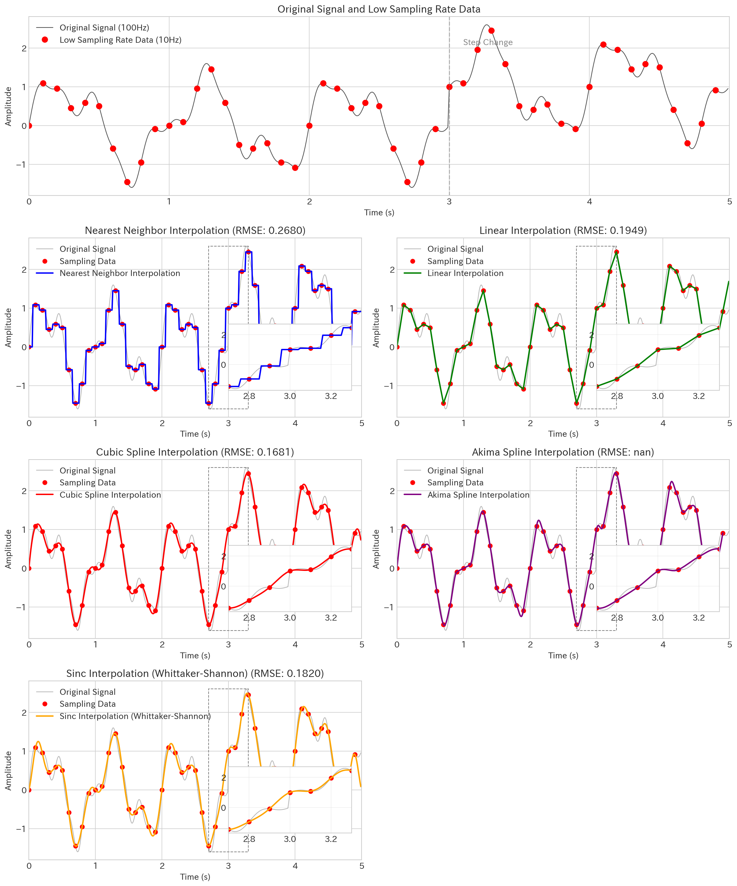

# 高次元時系列データのリサンプリング原則

---

## 1. 高次元時系列データ解析における基本ルール

**高次元時系列データを適切に解析するためには、以下の4つの基本ルールを守る必要があります：**

1. **全項目でサンプリングレートを統一しなければならない**
   - 異なるサンプリングレートのデータを直接比較すると、統計的整合性が崩れ、相関分析や異常検知の精度が著しく低下します。

2. **全期間でサンプリングレートが変化してはならない**
   - 期間の途中でサンプリングレートが変わると、時系列の定常性が破壊され、データの連続性が損なわれます。

3. **単純に間引く方法でダウンサンプリングしてはならない**
   - ダウンサンプリングする場合は、事前にローパスフィルターをかけて高周波成分を除去する必要があります。これを怠ると「折り返し歪み（エイリアシング）」が発生し、信号情報の不可逆な損失につながります。

4. **アップサンプリングは慎重に行う（できれば避ける）**
   - アップサンプリングは欠落した情報を「創造」することはできず、あくまで既存情報に基づく推測です。補間データの利用には常に「これは推定値である」という認識が必要です。

---

## 2. 基本ルールの詳細解説

### 2.1 全項目でサンプリングレートを統一する必要性

#### 2.1.1 統計的整合性の確保
- **同時性の原理**: 時系列分析では「同じ時間軸上の比較」が前提となる
  - 異なるサンプリングレートは時間軸の不整合を生じさせ、統計的な同時性が崩れる
  - 例：1秒間隔の圧力と10秒間隔の温度を直接比較すると、9つの圧力データ点に対応する温度データが存在しない

- **統計モーメントの正確性**: 平均・分散・歪度・尖度などの統計量計算の前提が崩れる
  - 高サンプリングレートの項目は低サンプリングレートの項目に比べて過剰にカウントされる
  - 例：10分間のデータで1秒間隔の項目は600点、10秒間隔の項目は60点となり、統計的重みが10倍異なる

> **重要ポイント**: サンプリングレートが異なるデータ間の比較では、時間的一貫性と統計的均質性が失われ、分析結果が系統的に歪む可能性があります。

#### 2.1.2 相関分析への影響
- **相関係数の歪み**: 同一時点での観測値ペアが減少し、真の相関が計算できない
  - 数学的に証明可能な問題：異なるサンプリングレートで計算された相関係数は一致しない
  - シミュレーションによる実証：同一プロセスから異なるレートでサンプリングした場合、相関係数の誤差は+-40%に達する


*図1: 異なるサンプリングレートによる相関係数の歪み。理論値0.8の相関を持つ信号をサンプリングした場合の相関係数比較。同一レート（1秒）では平均0.83で安定しているが、異なるレート（1秒/5秒、1秒/10秒）では最小値が大幅に低下し、値のばらつきが著しく増大する。特に10秒サンプリングでは相関が0.13まで低下するケースも観測される。*

```
【例証】真の相関0.8のプロセスから異なるレートでサンプリングした場合の相関係数
- 同一レート（1秒）：0.70～0.92 （平均0.83、理論値に近い）
- 異なるレート（1秒と5秒）：0.31～0.97 （平均0.82、ばらつきが大幅に増加）
- 異なるレート（1秒と10秒）：0.13～0.97 （平均0.78、著しい歪みと不安定性）
```

> **重要**: サンプリングポイントの相対的な位置や位相によって相関係数が大きく変動します。これは単なる数値的アーティファクトではなく、異なるサンプリングレートのデータを直接比較することの根本的な問題を示しています。

- **時間遅れ検出の困難化**: 因果関係分析において重要な時間遅れ（ラグ）の正確な検出が不可能
  - 最小サンプリング間隔より小さな時間遅れは検出できない
  - 異なるサンプリングレート間での最適ラグ検出は理論的に不正確になる

#### 2.1.3 機械学習モデルへの悪影響
- **特徴量バランスの崩壊**: 高サンプリングレートの項目が学習を支配する
  - モデルが高頻度データに過度に適合し、低頻度データの特徴を無視する傾向
  - 入力変数間のサンプリングレート差が重要度の錯誤評価を引き起こす

- **過学習リスクの不均一性**: 高サンプリングレート項目のノイズへの過適合
  - 高頻度項目のノイズパターンに対する過学習が生じやすく、モデル全体の汎化性能を低下させる
  - 信号対ノイズ比(SNR)の不均衡による予測精度のバラつき増大

#### 2.1.4 異常検知における致命的問題
- **見落としと誤検知のトレードオフ崩壊**:
  - 高サンプリングレート項目: 短期的揺らぎ（ノイズ）が多く、誤検出（False Positive）増加
  - 低サンプリングレート項目: 短期異常を捉えられず、見落とし（False Negative）増加
  - この不均衡は異常検知アルゴリズムのパラメータチューニングを著しく困難にする

- **時間帯による検知感度のズレ**:
  - 日によって、時間帯によってサンプリングレートが変動する場合、同じ閾値でも異常検知感度が一定でなくなる
  - 結果として、特定の時間帯の異常だけを過剰に検出する状況が発生

> **要約**: 異なるサンプリングレートのデータを直接組み合わせると、統計分析が歪み、相関係数が過小評価され、機械学習モデルの過学習や誤った特徴量重要度評価につながり、異常検知の精度と信頼性が著しく低下します。

---

### 2.2 期間中のサンプリングレート一貫性の重要性

#### 2.2.1 時系列の定常性破壊
- **定常性仮定の崩壊**: ほとんどの時系列分析手法は定常性（stationarity）を仮定
  - サンプリングレート変化点を境に「観測プロセスの本質的特性が変化」したと見なされる
  - 非定常性は自己相関、トレンド検出、季節性分析などの基本的な時系列分析手法を無効化

- **エルゴード性の喪失**: 時間平均と集合平均の等価性が失われる
  - 長期解析において、統計的推論の基盤となるエルゴード性（時間平均≈集合平均）が保証されなくなる
  - 結果として、同じデータセット内での期間比較や総合評価が不可能になる

#### 2.2.2 データ結合とモデル学習への影響
- **前後データの非互換性**:
  - レート変更前後のデータを単純に結合できず、時系列の連続性が損なわれる
  - 学習データとテストデータでサンプリングレートが異なると、モデルの評価結果が歪む

- **学習データとしての質の劣化**:
  - 機械学習モデルがサンプリングレート変化を特徴量と誤認識
  - 予測モデルがサンプリング構造を「学習」してしまい、実際のプロセス挙動を正しく捉えられなくなる
  - 結果として過学習と低い一般化性能を招く

- **メタ分析の妨げ**:
  - 複数期間にまたがる長期傾向分析や季節性分析が困難になる
  - データセット同士の比較可能性（comparability）が損なわれる

> **要約**: サンプリングレートが途中で変わると、時系列データの定常性が破壊され、時間的な連続性が損なわれます。また、機械学習モデルがレート変化自体を特徴として学習してしまい、データ品質と予測能力が大幅に低下します。

---

### 2.3 ダウンサンプリング前のローパスフィルタリングの必要性

#### 2.3.1 折り返し（エイリアシング）を防ぐための基本原理

ダウンサンプリングとは、時系列データを間引いて少ない点数で再構成する操作ですが、このときに**高周波成分（急激な変化）**をそのまま残してしまうと、それが低周波に「折り返される（aliasing）」という現象が発生します。

これは、ナイキスト＝シャノンのサンプリング定理に反する処理であり、本来データ内に存在しない周期的な歪みが出現し、**信号の形状が根本的に変質する**という重大な問題を引き起こします。


**図2：ローパスフィルタを省略したダウンサンプリングによる不可逆な信号の歪み（エイリアシング）**
青線は元の高周波信号（20Hz）を十分なサンプリングで記録したもの。  
黒点はそれを間引いてサンプリングした点を示し、赤線はその点を補間して得られた再構成信号。  
ローパス処理を行わずに間引いたことで、再構成信号には元には存在しない周期・波形が現れており、これが**折り返し歪み（aliasing）**の典型例である。  
この歪みは一度発生すると元に戻すことができず、**信号情報の不可逆な損失**につながる。

#### 2.3.2 ローパスフィルターの役割とその必要性

このような折り返しを防ぐためには、**ダウンサンプリング前に信号をあらかじめ「滑らかに」しておく**必要があります。これを担うのが**ローパスフィルター**です。

ローパスフィルターとは、**ある周波数以上の成分（＝細かい変動）を除去する処理**で、信号から高周波成分を取り除いてから間引くことで、折り返しが発生しないようにします。

この処理を施さずに単純に間引くと、上図に示すように、**元信号とまったく異なる周期や振幅の歪んだ信号**が得られてしまいます。これは一度発生すると後処理では修正不可能であり、**情報の不可逆な損失**につながります。

---

#### 2.3.3 実装上の対策：移動平均フィルターの活用

最も基本的で実装しやすいローパス処理が「移動平均」です。これは、信号の各点を前後の一定範囲の平均でならすことで、信号を滑らかにし、高周波成分を減衰させるものです。

たとえば、10秒ごとに間引く場合には、その前に「10点の移動平均」をかけることで、10秒ごとの代表値が周囲の情報を適切に反映するようになります。

> ※ここでの「10点」はサンプリング間隔ではなく、元のデータにおける点数。たとえば元が1秒間隔なら「10点＝10秒」になります。

---

#### 2.3.4 エンジニアリング上の設計指針：移動平均窓サイズの決定方法

ダウンサンプリングを正しく行うためには、適切なローパスフィルターの設計が必要です。ここでは具体的な設計指針を説明します。

**基本概念の整理：**
- **ダウンサンプリング率R**：元のデータを何分の1に間引くかを表す比率（例：10秒間隔データを作るために1秒間隔データを1/10に間引く場合、R=10）
- **カットオフ周波数**：ローパスフィルターが通過させる最大周波数（これより高い周波数成分は減衰させる）
- **窓サイズN**：移動平均計算に使用するデータ点の数

**ナイキスト周波数との関係：**
信号処理の基本原理であるナイキスト・シャノンの定理によれば、サンプリング周波数は表現したい最大周波数の少なくとも2倍必要です。逆に言えば、サンプリング周波数の1/2より高い周波数成分はダウンサンプリング後に正確に表現できません。

ダウンサンプリング率がRの場合、新しいサンプリング周波数は元の1/Rになるため、保持できる最大周波数（ナイキスト周波数）も元の1/Rになります。これを数式で表すと：

**元のナイキスト周波数 × (1/R) = 新しいナイキスト周波数**

この新しいナイキスト周波数を超える成分を事前に除去する必要があるため、ローパスフィルターのカットオフ周波数は次のように設定する必要があります：

**カットオフ周波数 ≦ 元のサンプリング周波数 × (1/2R)**

例えば、元のサンプリング周波数が1Hzで、10倍間引く（R=10）場合、カットオフ周波数は0.05Hz以下（1Hz×1/20）に設定すべきです。

**移動平均フィルターと窓サイズの関係：**
移動平均フィルターを使用する場合、窓サイズNとカットオフ周波数には次の近似的な関係があります：

**カットオフ周波数 ≈ 元のサンプリング周波数 × (1/2N)**

この関係から、必要な窓サイズを求める式が導かれます：

**N ≧ R × 安全係数**

ここで安全係数（通常は1.2～1.5程度）を掛けるのは、移動平均フィルターの遮断特性が急峻でなく、徐々に減衰していくため、理論上の最小値よりも少し大きな窓サイズを使用して、確実に高周波成分を除去するためです。

**具体例：**
- 1秒間隔データを10秒間隔に間引く場合（R=10）
- 安全係数を1.2とすると
- 必要な窓サイズN ≧ 10 × 1.2 = 12
- つまり、少なくとも12点の移動平均をかけてから間引く必要がある

このように窓サイズの設定は、単に「滑らかに見せるため」という見た目の問題ではなく、信号処理の理論に基づく**折り返し歪みを防止するため**の計算に基づいて決定すべきものです。

---

#### 2.3.5 結論：ローパス処理は必須ステップである

- ローパス処理を行わないダウンサンプリングは、**原理的誤り**を含む
- 折り返し歪みによる信号変質は、**以後のすべての分析や学習モデルに悪影響を与える**
- ローパスフィルターは単なるノイズ除去ではなく、**正しいダウンサンプリングの前提条件**

> このステップは「してもしなくてもいい操作」ではなく、「必ずしなければならない処理」です。

---

### 2.4 アップサンプリングの可能性と限界

#### 2.4.1 主要なアップサンプリング手法
- **線形補間法**:
  - 実装: 隣接する2点間を直線で接続
  - 利点: 計算が単純、直感的に理解しやすい
  - 欠点: 高周波情報の復元ができない、曲線的な変化を表現できない

- **スプライン補間法**:
  - 実装: 3次多項式などによる滑らかな曲線での補間
  - 利点: 滑らかな補間曲線、2階微分まで連続性を保証
  - 欠点: オーバーシュート発生の可能性、計算コストが高い

- **シンク補間法**:
  - 実装: サンプリング定理に基づく理論的に正確な補間
  - 利点: 帯域制限信号の完全な復元が理論的に可能
  - 欠点: 無限長インパルス応答、計算コストが非常に高い、ギブス現象

- **最近傍補間**:
  - 実装: 最も近いサンプル点の値を使用
  - 利点: 極めて単純、ステップ応答の保存
  - 欠点: 非常に粗い近似、高周波ノイズの増加


*図3: 主要な補間方法の比較。最近傍法、線形補間、3次スプライン、Akimaスプライン、シンク補間を適用した結果と各手法のRMSE誤差。右下の拡大図では急激な変化（ステップ）付近での各手法の挙動の違いを示している。*

#### 2.4.2 アップサンプリングの限界
- **情報理論による根本的制約**:
  - ナイキスト周波数以上の情報は原理的に復元不可能
  - 「無から有は生じない」原則：元データにない情報は真に復元できない
  - 補間はあくまで「もっともらしい推測」であり、真の信号の保証はない

- **実用面での制約**:
  - 高周波成分の欠落: 急激な変化や短時間イベントの検出が困難
  - 位相情報の喪失: イベント発生タイミングの正確な推定ができない
  - 誤った確信: 補間された値が実測値と誤認されるリスク

- **補間の精度と計算コストのトレードオフ**:
  - 高精度な補間は計算コストが高くなる傾向
  - スプライン補間やシンク補間は高精度だが、計算負荷が大きい
  - 線形補間や最近傍補間は計算が軽いが、精度が低下する

> **重要ポイント**: アップサンプリングは欠落した情報を「創造」するものではなく、あくまで既存情報に基づく補間です。補間データの利用には常に「これは推定値である」という認識が必要です。可能であれば、元の項目名を変更し、補間データであることを明示することが推奨されます。

#### 2.4.3 適応的補間戦略
- **物理モデルとの組み合わせ**:
  - 対象プロセスの物理法則に基づく制約付き補間
  - 例：熱伝導方程式に基づく温度変化の補間、流体力学モデルに基づく圧力変化の補間
  - 利点：物理的整合性の確保、過去の知見の活用

- **マルチレート信号処理**:
  - 異なるサンプリングレートの複数信号を組み合わせた相補的補間
  - 相関の高い高サンプリングレート信号を使って低サンプリングレート信号を補間
  - 例：圧力（高頻度）と温度（低頻度）の相関を利用した温度の補間

- **ベイズ推定アプローチ**:
  - 事前確率分布を用いた確率的補間
  - 不確実性の定量化（補間値の信頼区間の提供）
  - プロセス知識の組み込みによる精度向上

#### 2.4.4 応用シナリオ別の推奨手法

| シナリオ | 推奨補間法 | 主な選定理由 | 特性 |
|----------|------------|--------------|------|
| リアルタイム監視 | 線形補間<br>最近傍補間 | 計算効率重視 | ・低計算コスト<br>・遅延最小化<br>・実装が容易 |
| トレンド分析 | スプライン補間 | 滑らかさ重視 | ・視覚的に自然<br>・派生量（速度、加速度）の計算に適する<br>・ノイズに強い |
| 異常検知 | 物理モデル拘束付き補間 | 物理的整合性重視 | ・誤検知の低減<br>・真の異常と補間エラーの区別が可能<br>・知識ベースの判断を反映 |
| 制御応用 | カルマンフィルタ<br>予測器 | 時間的整合性重視 | ・将来値の予測が可能<br>・多変数間の関係を考慮<br>・動的システムに適合 |
| 後解析 | シンク補間<br>高次スプライン | 精度重視 | ・理論的に最適な復元（帯域制限信号）<br>・詳細な波形解析に適する<br>・後解析であれば計算コストは問題にならない |

> **要約**: 各補間手法には固有の長所と短所があり、シナリオに応じた適切な選択が重要です。常に原理的な限界を認識し、物理モデルやマルチレート信号の相関関係、ベイズ推定などを活用することで補間精度を向上できます。

---

## 3. IF-HUBでの実装と適用

IF-HUBは前述の原則を実際のデータ処理に適用するための機能を提供しています。この章では、これらの原則をIF-HUBでどのように実装するかを示します。

### 3.1 IF-HUBでのサンプリングレート統一機能

IF-HUBでは、以下の機能を通じて異なるサンプリングレートのデータを統一することができます：

- **移動平均処理API**: 適切な窓サイズを設定した移動平均フィルタを適用し、ダウンサンプリング前にローパスフィルタリングを実現
- **gtag機能による仮想タグ生成**: 異なるサンプリングレートのタグを同一レートに変換する仮想タグを定義
- **単一サンプリングレートでのバッチ取得**: 複数のタグを同一サンプリングレートでまとめて取得する機能

#### 移動平均処理の例（クエリパラメータ）：

```
GET /api/data/Pump01.Temperature?processing=moving_average&window=12
```

#### 移動平均処理の例（gtag定義）：

```json
{
  "name": "Pump01.TempMA",
  "type": "moving_average",
  "inputs": ["Pump01.Temperature"],
  "window": 12,
  "description": "適切な窓サイズで移動平均した温度信号",
  "unit": "°C"
}
```

### 3.2 サンプリングレート変換のベストプラクティス

IF-HUBを使用してサンプリングレートを変換する際の推奨方法：

1. **より高いサンプリングレートへの統一は避ける**：
   - 低サンプリングレートのデータを高いレートに上げるのではなく、すべてを最小公分母のレートに下げる

2. **適切な窓サイズの選択**：
   - 本文書の2.3.4で説明した計算式に基づき、ダウンサンプリング率に安全係数を掛けた値を窓サイズに設定

3. **処理済みデータの明示**：
   - 元のタグ名とは異なる命名規則を使用し、処理済みデータであることを明示
   - メタデータに処理内容を記録

4. **処理パイプラインの構築**：
   - gtagを活用して処理パイプラインを構築し、再現性と共有性を確保

### 3.3 IF-HUBにおける将来の拡張

現在のIF-HUBは基本的な時間シフト機能（`timeshift`パラメータ）を提供していますが、今後の拡張として以下の機能を計画しています：

- **項目ごとに異なるタイムラグを設定**できる機能：上流工程と下流工程の間の物理的な時間遅れを正確にモデル化
- **高度なフィルタリングオプション**：移動平均だけでなく、FIRフィルタやバターワースフィルタなどの実装
- **インテリジェントなサンプリングレート検出**：データの特性に基づいて最適なサンプリングレートを提案

これらの拡張により、より理論的に正確で実用的な時系列データ処理がIF-HUBで可能になる予定です。

---

時系列データの適切な処理は分析の信頼性と価値を大きく左右します。本文書で説明した原則を理解し、IF-HUBの機能を活用することで、高次元時系列データから真の洞察を得ることができるでしょう。
